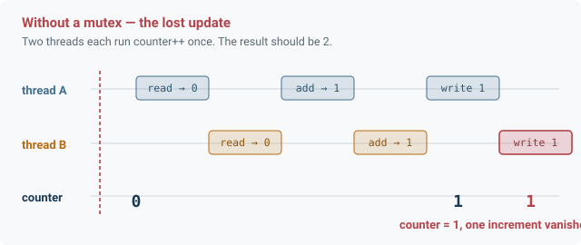
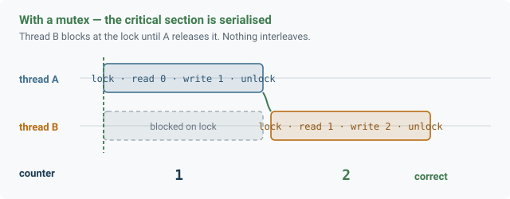

<div align="center">

# Linux OS Space

**Systems programming against the Linux API — processes, threads, synchronisation.**

Operating Systems coursework at the Technical University of Cluj-Napoca.


</div>

---

Everything here targets the POSIX API directly. No runtime abstracts the system calls away — the interesting part is what the kernel does when you make them.

<br>

## Contents

| Folder | What it covers |
|---|---|
| [working-with-threads](working-with-threads) | Thread creation and joining, shared state, mutual exclusion |
| [Assignments](Assignments/Assignments-an-2-sem-2) | Course assignments, year 2 semester 2 |

<br>

## Concurrency notes

<details open>
<summary><b>Why threads are cheap and what that costs you</b></summary>
<br>

`fork()` gives a child process its own address space. Anything the parent and child want to share has to travel through a pipe, shared memory segment, or file. Isolation by default.

`pthread_create()` gives you a thread inside the same address space. Every global, every heap allocation, every file descriptor is shared immediately. That is why threads are fast to create and fast to communicate between.

It is also the entire source of the difficulty. In a multi-process design the kernel prevents interference. With threads, nothing does — you have to.

```c
pthread_t t;
pthread_create(&t, NULL, worker, &arg);
pthread_join(t, NULL);          // block until it finishes
```

`pthread_join` is not optional bookkeeping. A thread that is neither joined nor detached leaks its stack and descriptor when it exits. Either join it or call `pthread_detach`.

</details>

<details>
<summary><b>The race condition, step by step</b></summary>
<br>



`counter++` looks atomic in C. It is not. It compiles to three machine operations — load the value, add one, store it back — and the scheduler can preempt the thread between any two of them.

The animation shows the failure: both threads read 0 before either writes. Both compute 1. Both store 1. One increment disappears without a trace.

What makes this the hardest class of bug is that it is timing-dependent. The same binary produces the right answer a thousand times and the wrong one on the thousand-and-first, usually on a machine you cannot attach a debugger to. Adding a `printf` to investigate changes the timing and the bug goes away.

</details>

<details>
<summary><b>The fix, and what it costs</b></summary>
<br>



A mutex makes the read-modify-write sequence indivisible. A thread that finds the lock held blocks in the kernel until the holder releases it.

```c
pthread_mutex_lock(&m);
counter++;                      // critical section
pthread_mutex_unlock(&m);
```

The cost is that the critical section is now serial — that part of the program gets no benefit from extra cores. Which leads to the rule that governs every locking decision: **hold the lock for as little work as possible.** Compute outside, lock, write, unlock. Doing file I/O while holding a mutex is how a program with eight threads ends up slower than one with a single thread.

Two failure modes to know:

- **Deadlock** — thread A holds lock 1 and wants lock 2 while thread B holds lock 2 and wants lock 1. Neither ever proceeds. The standard prevention is a global lock ordering: every thread acquires locks in the same sequence.
- **Forgetting to unlock** on an early `return` or error path. Every exit from a critical section has to release the lock.

</details>

<details>
<summary><b>When a mutex is the wrong tool</b></summary>
<br>

A mutex protects data. It does not let one thread wait for something to become true.

Spinning on a flag while holding a lock burns CPU and blocks the very thread that would set it. The answer is a condition variable:

```c
pthread_mutex_lock(&m);
while (queue_empty)                     // while, not if — spurious wakeups happen
    pthread_cond_wait(&cond, &m);       // releases m, sleeps, reacquires on wake
consume();
pthread_mutex_unlock(&m);
```

`pthread_cond_wait` atomically releases the mutex and sleeps, which closes the gap where a signal could arrive between unlocking and sleeping and be lost forever.

The `while` matters. `pthread_cond_wait` can return without any thread having signalled, and by the time a woken thread reacquires the lock another thread may have already consumed the item. Recheck the condition after every wake.

</details>

<br>

## Building

```bash
gcc -Wall -Wextra -pthread program.c -o program
./program
```

`-pthread` is required and is not the same as `-lpthread` — it also sets the preprocessor flags the threading headers expect.

<br>

## Debugging concurrency

| Tool | What it finds |
|---|---|
| `valgrind --tool=helgrind ./program` | Data races, lock-ordering problems, misuse of the pthreads API |
| `gcc -fsanitize=thread` | Data races, with lower overhead than Helgrind |
| `gcc -fsanitize=address` | Buffer overruns, use-after-free, leaks |
| `strace ./program` | Every system call the program makes |

Helgrind catches races that have not happened yet in any run you have done, which is exactly the property you want. Run it on anything with shared state before believing the program works.

<br>

## Repository

```
Linux-OS-Space/
├── docs/                             diagrams used by this README
├── working-with-threads/
└── Assignments/
    └── Assignments-an-2-sem-2/
```
